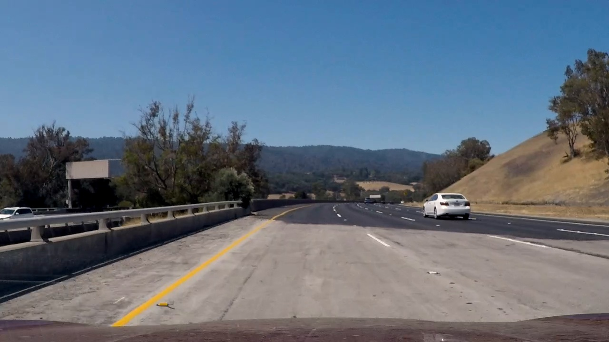
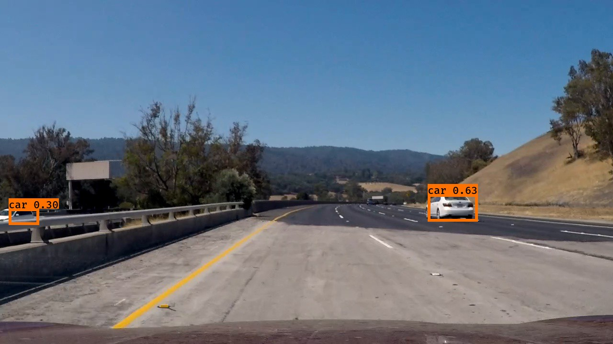
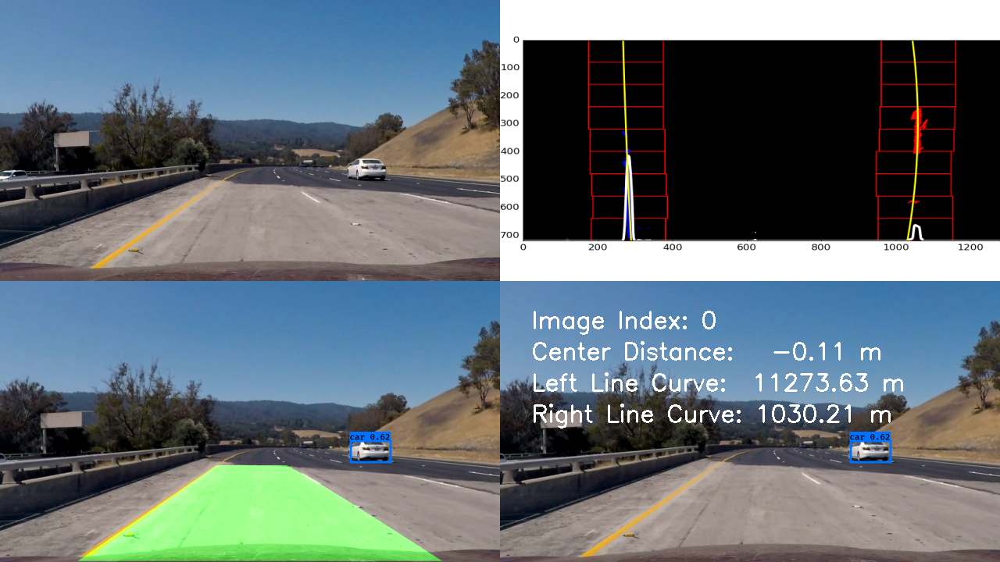
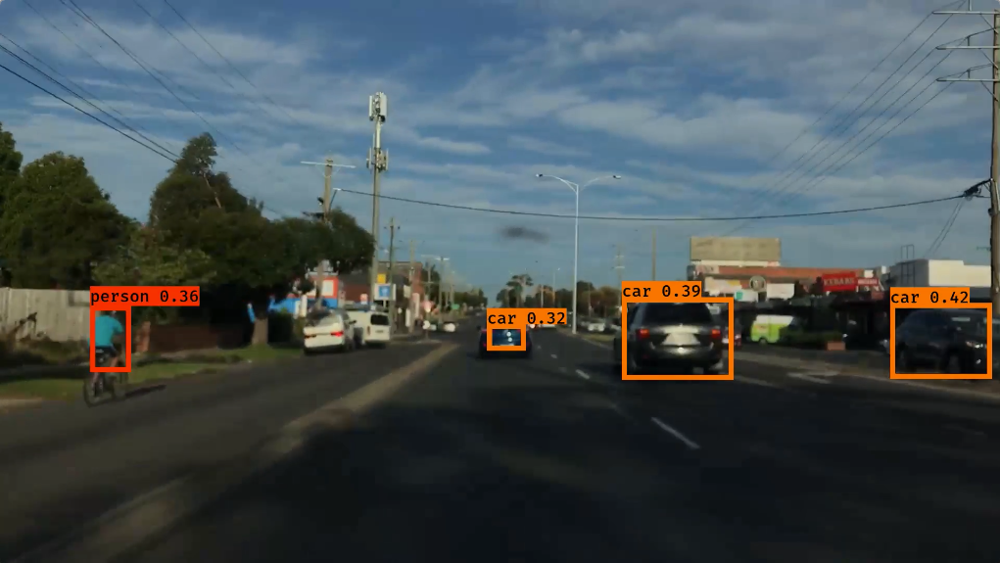

# Vehicle Detection
[](http://www.udacity.com/drive)


In this project, your goal is to write a software pipeline to detect vehicles in a video (start with the test_video.mp4 and later implement on full project_video.mp4)

## Object Detection
I have spent some time on trying SVM, color and gradient features to detect vehicle, 
svm has very good training accuracy but when testing in real life the accuracy dropped a lot. 
In this project, I spend longer time to apply YOLO
detector in this project, it succeeded in project video, I then created a video from my iphone
which was mount in my car, YOLO performed very well on it as well.

## Project Video (High way)
In this video, camera calibration has been provided in folder `camera_cal`, lane finding and 
object detection images are camera calibrated.

<a href="http://www.youtube.com/watch?feature=player_embedded&v=Fi9j5cr_qEk" target="_blank">
</a>


## My Commuting Video
In this video there are cars in front of me which is the main problem for color and gradient
lane finding solution, so that I only applied object detecting into this video. we can see that
YOLO doing a great job here in detecting and tracking cars, traffic lights, etc.

<a href="http://www.youtube.com/watch?feature=player_embedded&v=OksuVuNY5o0" target="_blank">
</a>


## YOLO(You Only Look it Once) Object Detection 
[You only look once (YOLO)](https://pjreddie.com/darknet/yolo/) is a state-of-the-art, 
real-time object detection system. In this project I'm using [YAD2K project](https://github.com/allanzelener/YAD2K)
which is a Keras / Tensorflow implementation of YOLO_v2

>please note as we using YAD2K project, we have to install the specific version documented in YAD2K project page.

#####YOLO overall structure


### How YOLO works
1. Image will divided into small grid cell, for example 7 * 7
2. Every cell predict number of bounding box, every box contains
  - center_point_x
  - center_point_y
  - bounding_box_width
  - bounding_box_height
  - object_probability 
3. Every cell predict the probability of number of classes
4. Apply a threshold to all bounding_box


if we split image into 7 * 7 grid cell, each cell predict 2 bounding boxes, and we have 20 classes want to predict,
the total output would be 7 * 7 * （2 * 5 + 20) = 1470


### YOLO code in this project
The main code located in `object_detect_yolo.py`, all support files are in `yolo` folder.
- `yolo/cfg/yolo.cfg` defines the neural network structure
- `yolo/model_data/coco_classes.txt` defines how many classes system can detect
- `yolo/model_data/yolo.h5` the weights pre-trained on COCO dataset, follows yolo.cfg neural network structure

`predict` method in class `YoloDetector` is the main entry point, provide a image and it will 
return back bounding_boxes, scores and classes, for example:
- bounding_boxes=[[405, 786, 492, 934]]
- scores=[0.68]
- classes=[2]

 


For more test images, please visit [object detect folder](output_images/object-detect/)

## Merge YOLO with advanced lane finding
Class `LaneFinder` in `lane_finder.py` has been modified to add one more parameter called `object_detection_func`,
by default, it's a lambda which return a black image ```object_detection_func=lambda image: np.zeros_like(image)```

Undistored image will pass into object_detection_func and been added into final result.




##Discussion
1. Handle picked features not generalize enough
> As the experience in P3 advanced lane finding, and some experience in this project, I think the color, color space, 
gradient features with SVM or Decision Tress are not generalize enough, I think it's really depends on parameters 
which human provide, where deep learning approch is more define the lose function and let computer figure out what's
the best parameters, as long as we have lots of training data, it can do better then human picked parameters.

2. YOLO works really well
>The project video works really well as it dosen't have many elements
My own video was not focused properly, but still YOLO able to identify vehicles, traffic lights and a person on bicycle



3. a heat-map or moving average solution would beneficial still
>I noticed that it will miss some object in some frame, if we lower the threshold which resulting more object
been detected, at the same time create a heat map based on history data. 
For example a Car has been detected in last 3 frame, we have very high confidence that it will appear 
in frame 4 and 5, however if still not detected in frame 6, we can remove it away from our list.

